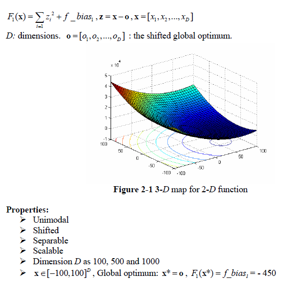
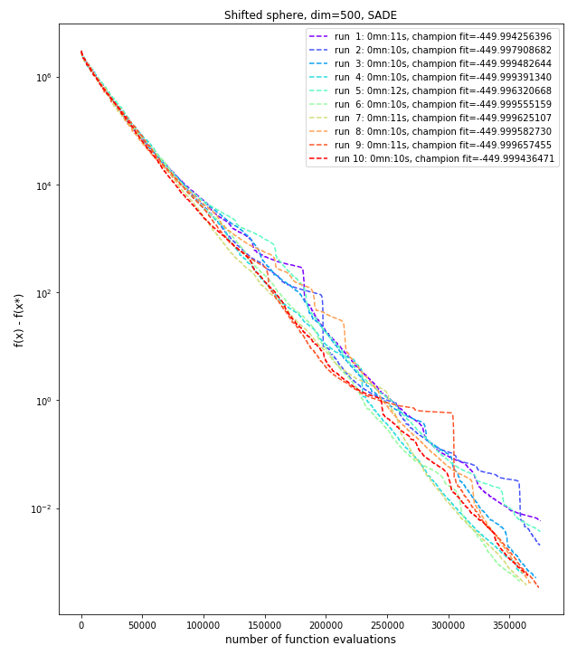
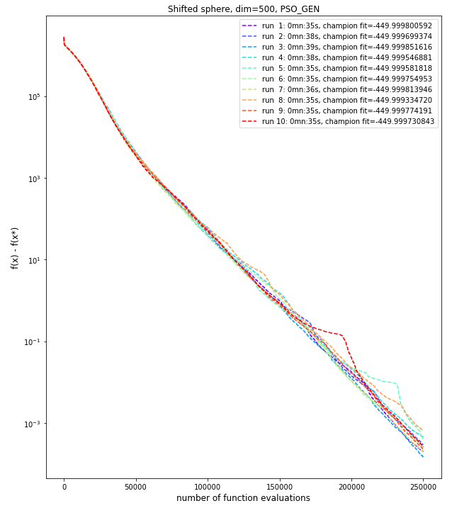

# Shifted Sphere problem
The Shifted Sphere problem is described below as per the **CEC'2008 competition** on large scale global optimisation:

This problem has only one optimum. We had therefore favor **intensification** over **diversification**.

## Dimension 50, 10 runs
In dimension 50, we used the **Particle Swarm Optimisation GENerational** algorithm (from Pygmo package), with the following configuration:

|PSO-GEN parameter|value|
|------------|-----|
|Inertia weight|0.7|
|Social component|0.5|
|cognitive component|4|
|Maximum velocity|0.05|
|Algorithmic variant|FIPS|
|Swarm topology|local best|

We ran the algorithm with a ***population size of 30*** and ***800 generations***. With this configuration, our best run gave the following results:

|PSO-GEN Results| |
|------------|-----|
|Number of function evaluations|24,000|
|Duration|668 ms|
|Best f value|-449.9999978|
|Difference with function's optimum value|0.0000022|
|L2 norm to optimum solution|0.0014702|

A plot of the fitness value as a function of the number of evaluation is shown below (with y axes using a log scale).

## Dimension 500, 10 runs
In dimension 50, we used both the **Particle Swarm Optimisation GENerational** algorithm and the **Self-Adaptative Differential Evolution** (also from Pygmo package) as comparison. PSO-GEN was used with the same configuration as for dimension 50. For SADE, we used the following configuration:

|SADE parameter|value|
|------------|-----|
|mutation variant|rand-to-best-and-current/2/bin|
|variant_adptv|1 (jDE)|
|ftol|1e-04|
|xtol|1e-03|

We ran the SADE algorithm with a ***population size of 75*** and ***5000 generations***, whereas we ran the GEN-PSO with a ***population size of 50*** and ***5000 generations*** to obtain similar function values.

SADE was superior to GEN-PSO in term of convergence time. We got our best solution with SADE in 11 seconds (with a stop criterion being ftol=1e-04), whereas it took PSO-GEN 39 seconds.

The best results for SADE and GEN-PSO are presented below.

|SADE Results| |
|------------|-----|
|Number of function evaluations|375,000|
|Duration|11 s|
|Best f value|-449.9996575|
|Difference with function's optimum value|0.0003425|
|L2 norm to optimum solution|0.0185080|

A plot of the fitness value as a function of the number of evaluation is shown below (with y axes using a log scale).

|PSO-GEN Results| |
|------------|-----|
|Number of function evaluations|250,000|
|Duration|39 s|
|Best f value|-449.9998516|
|Difference with function's optimum value|0.0001484|
|L2 norm to optimum solution|0.0121813|

